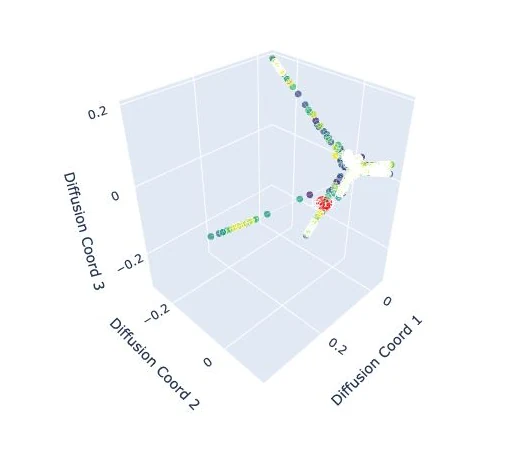

# Neural Trajectory Explorer

An interactive dashboard for exploring how populations of neurons respond over time. Compare trajectories in PCA space or in the activity coordinates of three neurons, inspect nearby trajectory crossings, and explore retinal and V1 encoding manifolds.



*A retinal encoding manifold from the project, also featured on [my website](https://skfile.github.io/#projects).*

## What you can explore

- Switch between retina and V1 recordings, and between PCA and neuron coordinates.
- Animate responses to different visual stimuli and select individual traces.
- Adjust spatial and temporal thresholds to inspect trajectory crossings.
- View encoding manifolds alongside trajectories and examine per-neuron response histograms.

## Run locally

Use Python 3.10 with the pinned dependencies:

```bash
git clone https://github.com/skfile/traceDashboard.git neural-trajectory-explorer
cd neural-trajectory-explorer
python3.10 -m venv .venv
source .venv/bin/activate
python -m pip install -r requirements.txt
python neural_trajectory_dashboard.py
```

Open <http://127.0.0.1:8050>. On Windows, activate the environment with `.venv\Scripts\activate`.

The repository includes the neural recordings and example manifold HTML files needed by the dashboard. Start with a small selection of traces; complex configurations may take 30–200 seconds to generate, as noted in the original implementation.

## Data and layout

```text
neural_trajectory_dashboard.py       Dashboard and controls
enhanced_trajectory_visualization.py Trajectory analysis and plotting
data/                              Retina and V1 recordings and cell metadata
encodingMans/                      Interactive encoding manifold HTML files
STIMULUS_MAPPING_DOCUMENTATION.md   Stimulus labels and mapping notes
requirements.txt                   Python dependencies
render.yaml / Procfile             Deployment configuration
```

The `data/` directory contains `retina_tensor_traces.npy`, `V1_tensor_traces.npy`, `retina_cell_info.pkl`, and `V1_cell_info.pkl`. Keep these files in place when running the application.

Manifold files are supplied in `encodingMans/`, using names such as `retina_close_triplet_1_neurons_219_908_325.html`. The application also checks the repository root for files with the same naming pattern.

## Notes

Plots are computed on demand. Reducing the number of traces or disabling crossing detection can reduce wait times. The default local port is `8050`; deployment settings can override it through `PORT`.

If data or manifold files cannot be found, check the directory layout above. For stimulus naming, see [the mapping documentation](STIMULUS_MAPPING_DOCUMENTATION.md).

The preview image is reused from the personal website and depicts a manifold from this repository; it is not a screenshot of the full dashboard interface.
